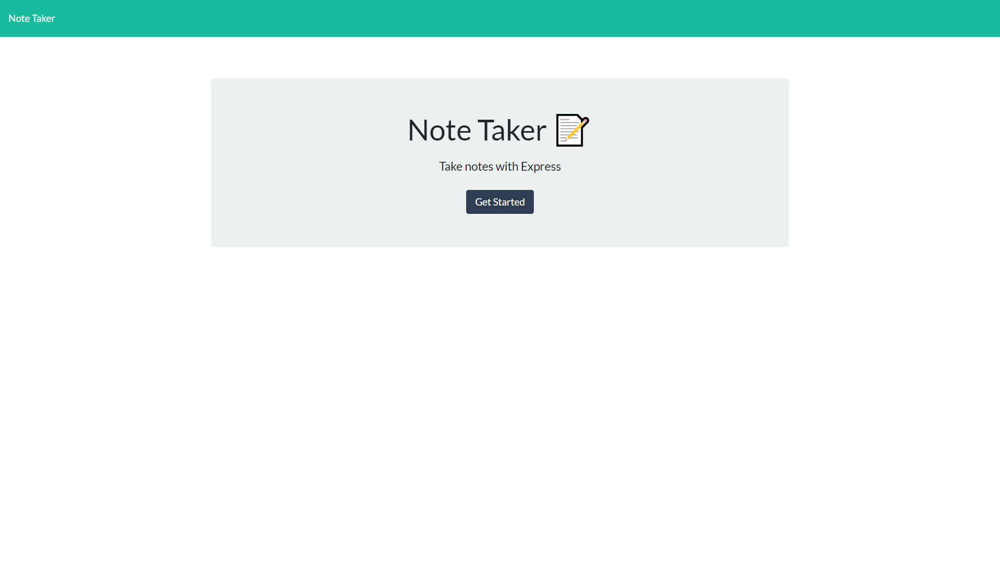
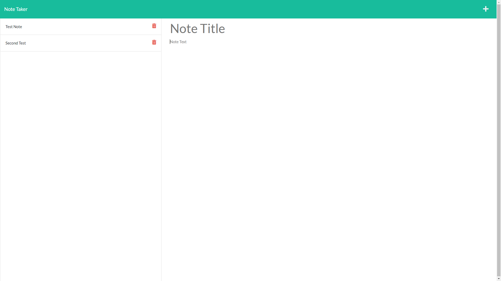

# Note-Taker 

This project is a web based application that allows the user to STORE and DELETE notes that can be added dynamically.

## Table of Contents

- [Installation](#installation)
- [Usage](#usage)
- [Contributing](#contributing)
- [Tests](#tests)
- [Questions](#questions)
- [License](#license)

## Installation

---

First you would need to `git clone` the repository, then go into the repo on your local machine. From there simply run an `npm i` or `npm install` to download the necessary packages.

## Usage

---

Once you have the project installed, you just need to run the `server.js` so you can test any changes made locally as well as ensuring any additional fetchs work as intended. If you'd rather do things the easy way, don't install the project at all. Just go the link provided and use it for yourself. From the start up screen `click` the 'Get Started' button, then on the notes page just type your note into the indicated fields and press the save icon to save it. You can also click the Trash icon to DELETE any saved note.

## Contributing

---

If you wanted to contribute, just install the project as described above and start making any changes you see fit. I'll happily approve and implement any change that boosts the functionality and responsiveness of the app.

## Tests

---

A vast amount of troubleshooting/debugging and also making test notes went into this project. It has been tested repeatedly to ensure every function works properly.

## Images/Screenshots

---

## Questions

---

For any questions you can reach me at:

Email: JerryGDev126@gmail.com

GitHub: https://github.com/JGuerrero126

## License

---

This project is protected under the Apache license and all relevant protections are granted.
